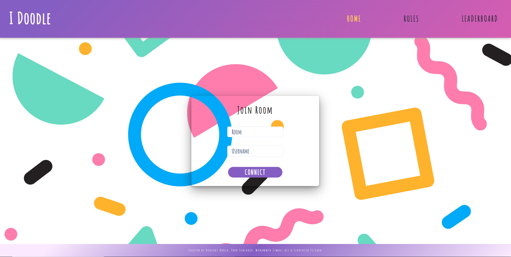
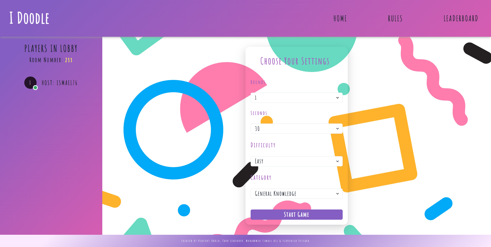
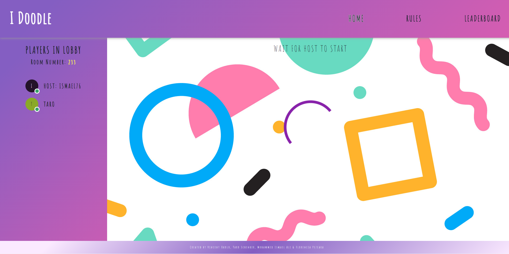
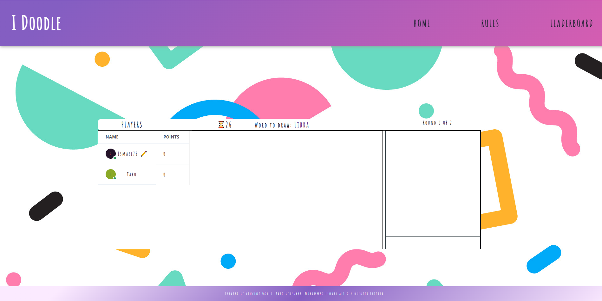

# IDoodle

To access the live version of the website please use this following link: https://idoodle-main.netlify.app/

# Project Description

IDoodle is a fun drawing game you can play with your friends. Simply join a room with your friends, choose your settings and then take turns to draw and guess to earn points and place youself on the real-time leaderboards!

# Features

 

 

# Implementation

## Installation & Usage

- Git clone/download this repository
- Open repository using GitBash or GitDesktop
- Open repository in Visual Studio Code

### Server

- Must git clone/download the server repository from: https://github.com/VAOkolo/Server--HPTQ1
- Right click on the server folder and choose `Open in Integrated Terminal`
- Run command `npm install` to download and install all node dependencies
- Run command `npm run dev` to start live development server

### Client

- Must git clone/download the client repository from: https://github.com/VAOkolo/Client--HPTQ
- Navigate into the client folder, run `npm install`
- To start the live react application run `npm start`

# Technologies

- GitHub
- GitBash (or GitDesktop, or any Terminal)
- Visual Studio Code
- CSS
- JavaScript
- React
- NodeJS
- MongoDB/Mongoose
- React
- ChakraUI
- Sockets.IO

## Process

The Project kicked off with a meeting to run through the purpose of the project and discuss potential solutions and ideas. The meeting was also carried out to ensure the team's focus and understanding of the requirements and needed deliverables.

Throughout the development stages of the project several meetings took place over Slack to ensure everyone was meeting the targets and assistance was provided in any areas each member was unsure about. This approach proved to be of great benefit for performance and efficiency as we were able to stay on track and implement alot of the requirements on time. Additionaly, it helped keeping the team stay focused and motivated.

## Future Work

- Eraser tool, and colour pallete added to allow users to change colour of drawing pencil.
- Allow users to customize their avatars.
- Allow users to create thier own custom word lists for the game.

## Wins & Challenges

### Wins

- Worked well as a team with assignment of tasks evenly. 
- Very organised work flow & structure.
- Managed to work with sockets.io and create a turn based game.

### Challenges

- Implementing sockets.io was very difficult to grasp at the beginning as it was a completely new technology we were exposed to.

# Licence

[MIT licence](https://opensource.org/licenses/mit-license.php)
